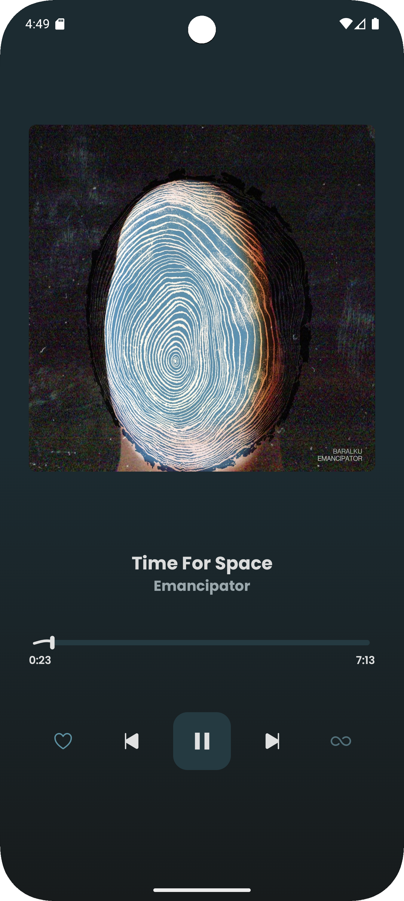
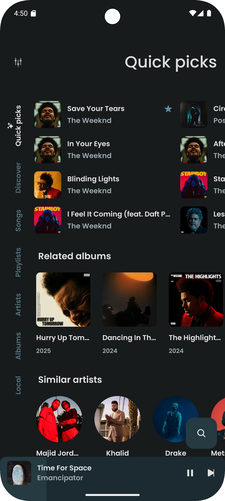
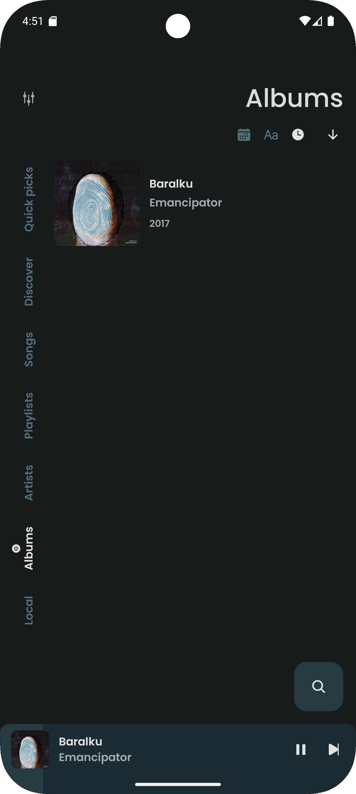
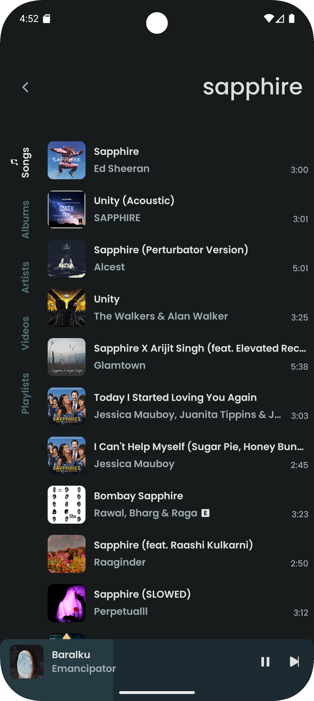
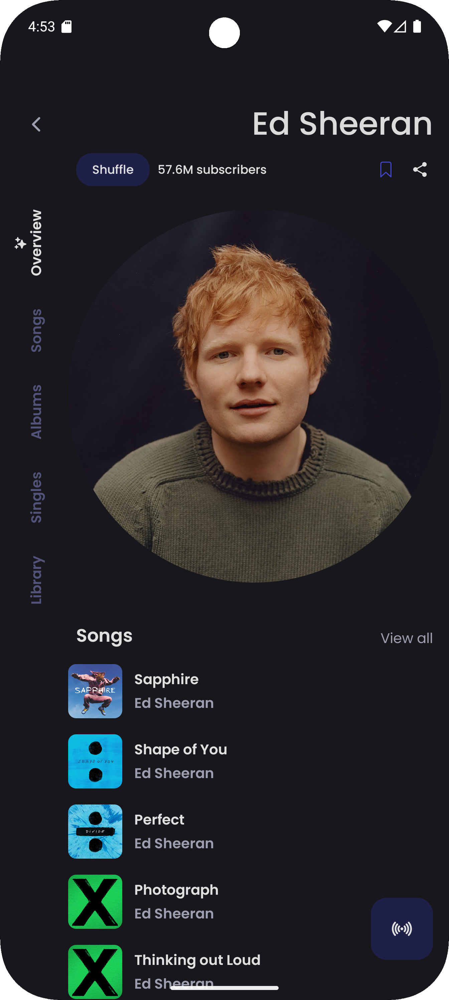
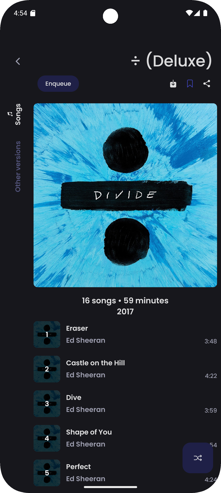

<div align="center">
    
    <h1>ViMusic</h1>
    <p>A powerful, feature-rich Android music streaming application</p>
    
[](https://github.com/chathuraz/ViMusic/releases)
[](LICENSE)
[](https://github.com/chathuraz/ViMusic/stargazers)
[](https://github.com/chathuraz/ViMusic/issues)
</div>

---

## 📱 Screenshots

<p align="center">
  
  
  
</p>

<p align="center">
  
  
  
</p>

## ✨ Features

### 🌟 Enhanced Features (This Fork)
* 🎤 **Word-Level Synced Lyrics** - Real-time, per-word highlighting for an immersive karaoke experience
* ↔️ **Universal Playlist Import** - Import playlists from any source that supports CSV export
* 💾 **Intelligent Lyrics Caching** - Local caching of word-level lyrics to optimize performance and data usage
* 🚀 **Enhanced Stream Reliability** - Powered by the robust **NewPipeExtractor** engine for improved streaming stability

### 🎵 Core Features
* 🎶 **YouTube Music Integration** - Stream virtually any song or video from YouTube Music
* 📁 **Local Media Support** - Play music files stored directly on your device
* 🌙 **Background Playback** - Continuous music playback when the app is minimized
* ✈️ **Offline Mode** - Cache songs for offline listening without internet connectivity
* 🔎 **Advanced Search** - Comprehensive search across songs, albums, artists, videos, and playlists
* ❤️ **Music Discovery** - Explore new music by mood, genre, and personalized recommendations
* 📝 **Synchronized Lyrics** - Display, edit, and manage standard synchronized lyrics
* 🎨 **Customizable Interface** - Dynamic theming with Material You design language support
* 🔊 **Audio Enhancement** - Built-in audio normalization for consistent volume levels
* 🚗 **Android Auto** - Seamless integration with in-car entertainment systems
* 🔗 **Smart Link Handling** - Direct opening of YouTube and YouTube Music links
* 🪶 **Lightweight** - Optimally sized APK for minimal storage footprint

## 📥 Installation

### Download from GitHub Releases

[](https://github.com/chathuraz/ViMusic/releases/latest)

### System Requirements
- **Android Version**: 6.0 (API level 23) or higher
- **Storage**: Minimum 50MB free space
- **Permissions**: Internet access for streaming, storage access for local files

## 🛠️ Building from Source

### Prerequisites
- Android Studio Arctic Fox or later
- JDK 11 or higher
- Android SDK with API level 34+

### Build Instructions
```bash
# Clone the repository
git clone https://github.com/chathuraz/ViMusic.git
cd ViMusic

# Build the APK
./gradlew assembleRelease
```

## 🤝 Contributing

We welcome contributions! Please feel free to submit issues, feature requests, or pull requests.

### How to Contribute
1. Fork the repository
2. Create a feature branch (`git checkout -b feature/your-feature`)
3. Commit your changes (`git commit -am 'Add some feature'`)
4. Push to the branch (`git push origin feature/your-feature`)
5. Open a Pull Request

## 📄 License

This project is licensed under the GPL-3.0 License - see the [LICENSE](LICENSE) file for details.

## 🙏 Credits & Acknowledgments

### Original Project
This project is based on the original ViMusic project. All credit for the foundational work goes to the original developers and maintainers.

**Original Repository**: [https://github.com/vfsfitvnm/ViMusic](https://github.com/vfsfitvnm/ViMusic)  
**Enhanced Fork**: [https://github.com/Jigen-Ohtsusuki/ViMusic](https://github.com/Jigen-Ohtsusuki/ViMusic)

### Third-Party Libraries & Resources
- [**YouTube-Internal-Clients**](https://github.com/zerodytrash/YouTube-Internal-Clients) - Research project for discovering hidden YouTube API clients
- [**NewPipeExtractor**](https://github.com/TeamNewPipe/NewPipeExtractor) - Robust streaming engine for enhanced reliability
- [**ionicons**](https://github.com/ionic-team/ionicons) - Premium hand-crafted icons by Ionic
- [**Flaticon: Ilham Fitrotul Hayat**](https://www.flaticon.com/authors/ilham-fitrotul-hayat) - Music note icon used in the app logo

### Special Thanks
- All contributors who have helped improve this project
- The open-source community for their invaluable libraries and tools
- Beta testers and users who provide feedback and bug reports

## ⚖️ Legal Disclaimer

**Important Notice**: This project and its contents are not affiliated with, funded, authorized, endorsed by, or in any way associated with YouTube, Google LLC, or any of their affiliates and subsidiaries.

Any trademark, service mark, trade name, or other intellectual property rights used in this project are owned by their respective owners.

This application is provided for educational and personal use only. Users are responsible for complying with applicable laws and terms of service when using this application.

---

<div align="center">
    <p>Made with ❤️ by the ViMusic community</p>
    <p>
        <a href="https://github.com/chathuraz/ViMusic/issues">Report Bug</a> •
        <a href="https://github.com/chathuraz/ViMusic/issues">Request Feature</a> •
        <a href="https://github.com/chathuraz/ViMusic">Source Code</a>
    </p>
</div>
